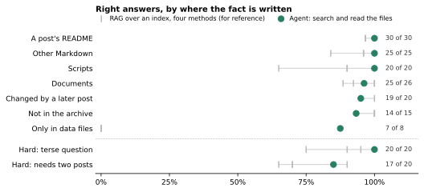
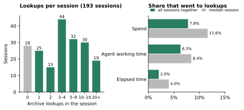

# Garbage in, garbage out? Fact recall in a minimally organized archive

**The thesis:** "garbage in, garbage out", the view that knowledge captured without care can't be retrieved well, is out of date for agent retrieval. A very small amount of upkeep gives very good retrieval. The view holds only where cost and latency are tight, and in many settings they aren't. It also stops people from starting to capture at all.

The measurements come from the private work archive of [Posts in use](../2026-10-04-one-work-archive/README.md), which follows [posts](https://github.com/spoj/posts). Its organization is minimal: a dated folder per post, a README in each, no index, and nothing purged when it goes out of date. On 3–4 October 2026, an agent answered 184 questions about it by searching and reading the files.

**The agent found 99% of single facts written in the archive's text, 97% of the main set and 92% of a harder set, at a median 32 seconds and about $0.07 a question. In 193 real sessions, archive lookups took 7.8% of spend and 2.0% of elapsed time.**

| Measure | Result |
|---|---|
| Single facts written in text: Markdown, scripts, documents | 100 of 101 right (99%) |
| Main set: those, plus changed facts, unanswerable questions and data-file facts | 140 of 144 (97%) |
| Hard set: terse questions, and questions needing two posts | 37 of 40 (92%) |
| Facts a later post changed, with nothing purged | the latest value 19 of 20 times |
| Questions the archive can't answer | "not found" 14 of 15 times; the 15th turned out to be answered in the archive |
| Per benchmark question | 7.4 tool calls, 32 s median, $0.068 at list prices |
| Per lookup in real sessions | 2 tool calls, 16 s, $0.08 (medians) |
| Lookups per session | median 4, mean 8.7 |
| Lookups' share of spend | 7.8% overall; 11.6% in the median session |
| Lookups' share of elapsed time | 2.0% overall; 4.0% in the median session |

*How many of each row's questions the agent got right. Grey ticks: four kinds of RAG over an index of the same text, for reference (below).*

## What an index buys

The same questions also went through retrieval-augmented generation (RAG) over an index of the archive's text. Agentic RAG searches and opens indexed files as often as it needs; single-shot RAG retrieves 20 passages once.

| Same questions | Agent: search and read | Agentic RAG | Single-shot RAG: hybrid / BM25 / dense |
|---|--:|--:|--:|
| Single facts in text (101) | 99% | 99% | 97% / 90% / 90% |
| Main set (144) | 97% | 92% | 92% / 87% / 87% |
| Hard set (40) | 92% | 95% | 80% / 80% / 72% |
| Per question: tool calls, median time, cost | 7.4, 32 s, $0.068 | 4.0, 20 s, $0.045 | 1, 8–9 s, $0.020–0.021 |
| Upkeep | none | an index of 4,102 text files: about 3 minutes and $1.78 per full build, kept current as the archive changes | the same |

With the index, agentic RAG took about a third less time and cost per question than the agent. It bought no measurable accuracy on facts both could see: 99% each on single facts, and on the hard set 95% against 92%, a single question (p = 1.0). It can't see facts that live only in data files, 8 of the main set, because a text index doesn't hold them. Single-shot RAG is cheaper again, but less accurate.

That trade pays only where cost and latency are tight. In these sessions, lookups were 7.8% of spend and 2.0% of elapsed time. They weigh more in the cheapest sessions: 31% of spend in sessions under $1, which together carry 1% of all spend.

## Lookups in real sessions

*The 193 sessions of [Posts in use](../2026-10-04-one-work-archive/README.md), 14 Sep–4 Oct 2026, with subagents counted under the session that started them. A lookup is one need answered from the archive: a run of searches and reads of earlier posts.*

| Per session | Median | Mean | Top tenth from |
|---|--:|--:|--:|
| Lookups | 4 | 8.7 | 19 |
| Tool calls per lookup | 2 | 3.5 | 7 |
| Lookup cost | $0.37 | $1.33 | $3.65 |
| Lookup share of session cost | 11.6% | 19.1% | 48.8% |
| Lookup time | 1.3 min | 4.0 min | 10.7 min |
| Lookup share of elapsed time | 4.0% | 8.7% | 26.1% |

165 of the 193 sessions looked something up. A session's lookup is shorter than a benchmark question, a median 2 calls against 7.4, as the agent often knows which post to open. Each call costs about four times as much, though, because it carries the session's context.

## Superseded facts: the weak spot, and its cheap fix

[Posts in use](../2026-10-04-one-work-archive/README.md) found that agents in real sessions often read a superseded post without its replacement: in 19 of 29 sampled sessions, with visible harm in one. Here, every question asked for the latest answer where sources disagree, and the agent gave the latest value for 19 of 20 changed facts. The two fit: the archive holds the latest value, but agents at work don't always look for it. The fix is part of the very small upkeep: link the replacement from the old post's README, as the posts guide asks. Only 13% of earlier posts did.

## Why starting matters more: the archive owner's view

*Argued, not measured.* "Garbage in, garbage out" makes capture sound like a curation project, so people put off starting. An archive begun with little care is already searchable, as measured here; one never begun holds nothing. In the archive owner's view, starting matters more than organizing.

## Scope and caveats

| Caveat | Effect |
|---|---|
| One archive and one strong model (gpt-6.1-sol at high thinking), one run per question | Other archives, weaker models or repeat runs may differ |
| Not compared with deliberately maintained capture, such as curated notes or periodic purging | That is the comparison that would test the format |
| A model drafted the questions from the archive's own files, and they name the things they ask about | Names make search easy; real questions can be vaguer |
| Answer keys were fixed before the runs; four proved wrong or ambiguous | Corrected, the agent scores 99% of 103 single facts, 99% of 145 main questions, 92% of the hard set and 14 of 14 unanswerable |
| The lookup rule overstates lookups by about a tenth, against hand labels | Session shares may be about 10% high |
| Agentic RAG ran alongside other jobs on the same model account | Its times may be inflated |

## Method

- **Archive:** a read-only copy at its last commit before 4 October: 235 posts, 17,516 files and 6.2 GB. Its text is post READMEs (0.6M tokens), other Markdown (2.6M), scripts (4.0M) and documents (4.4M); the rest is 6,625 data files and 6,789 others.
- **Questions:** claude-opus-5.5 drafted each from a random window of a randomly chosen file, as a colleague might ask, without file names or the source's wording. gemini-3.1-pro-preview checked support, ambiguity, uniqueness and currency against other passages; a fact stated in several files counts where it is shallowest. gpt-6.1-sol rechecked currency against later posts. Changed facts come from pairs of posts where a later one replaced a value; the hard set uses files the main set didn't.
- **Answering:** the agent was the Pi coding agent with gpt-6.1-sol at high thinking, shell and file-reading tools, the archive's instruction files as in real sessions, no web tools and a 20-minute limit. Every question came with the same answer format and the instruction to give the latest answer where sources disagree. RAG used the same reader over 28,421 chunks of up to 512 tokens, embedded with text-embedding-3-large; agentic RAG searched with hybrid ranking and could open indexed files, up to 15 calls.
- **Grading:** claude-opus-5.5 graded each answer three times, independently and blind to the method, and the majority label counts; 910 of 920 answers got the same label all three times. Right means correct, or "not found" where the archive is silent. Paired tests are exact McNemar.
- **Sessions:** a lookup call is a search across the archive, or a read of an earlier post the session didn't write. A lookup is a run of them; it survives one stray call and ends at a second, or at a user message after the agent has finished. Each model turn's recorded cost and time are split evenly across its tool calls. On a fresh held-out draw of five hand-labelled sessions, the rule found the same number of lookups (24), with 92% precision and 96% recall on lookup calls.
