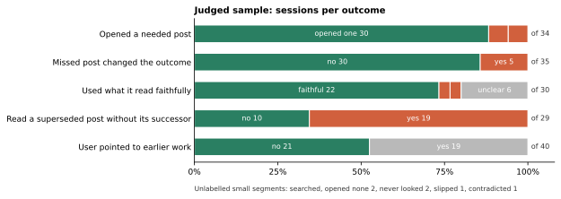
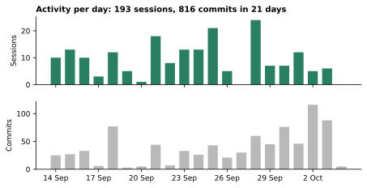
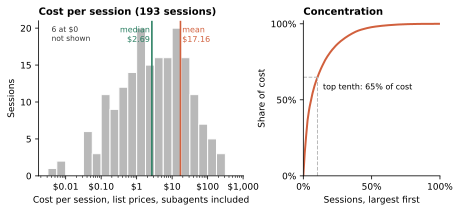
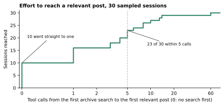
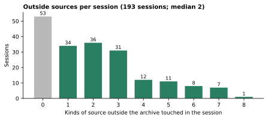

# Posts in use: one private work archive

Measured on 4 October 2026 in one private work archive that follows [posts](https://github.com/spoj/posts). It describes one setup and compares it with nothing.

**Agents found 87% of the earlier posts their task needed, in an archive of 236 posts.** A missed post changed the outcome in 5 of 35 sampled sessions.

| Metric | Result | Basis |
|---|---|---|
| Faithful use | 22 of the 24 sessions that could be judged used what they read faithfully; one slipped slightly and one contradicted its source | sample |
| Effort | 23 of 30 sessions reached a relevant post within 5 tool calls of their first archive search; 10 went straight to one | sample |
| Without help | with no pointer from the user, agents found 82% of the needed posts; the user pointed the way in 19 of 40 sessions | sample |
| Superseded posts | in 19 of the 29 sessions where a relevant post had a newer replacement, the agent read an old version without the new one; visible harm once. Only 13% of earlier posts link their replacement | sample |
| Linking | new posts linked or named 78% of the earlier posts a reader would need | sample |
| Breadth | a median session drew on 3 kinds of source, 2 of them outside the archive; 73% of sessions went outside it | all sessions |
| Session size | median 5 user messages, 51 model turns, 65 tool calls, 30 minutes and $2.69 at list prices | all sessions |
| Long tail | mean 9 messages, 176 turns, 207 tool calls and $17.16; the top tenth of sessions carry 65% of the cost | all sessions |
| Scale | 193 sessions, plus 165 subagent sessions, and 816 commits in 21 days | all sessions |

The sample is 40 sessions and 20 posts, judged by a model. Details and method follow.

*Each bar is one question about the judged sessions, as a share of the sessions it applies to.*

## The archive

- 236 posts in a private Git repository. 186 were written as dated posts in the 21 days since the archive adopted the format (14 Sep–4 Oct). The other 50 are older material moved into dated folders under their original dates, going back to May 2026.
- 816 commits in those 21 days, with commits on every day; 1,386 since the repository began in May.
- A typical post has 8 files: the README plus evidence and working.
- 86% of the posts written in the period link to at least one other post, and 84% are linked from one.

| Content | Files | Tokens |
|---|--:|--:|
| Authored Markdown (post READMEs alone: 0.6M tokens) | 982 | 3.3M |
| Know-how scripts: Python, SQL, JavaScript, shell, PowerShell | 2,492 | 4.0M |
| Domain documents, text only: PDF, Word, email, PowerPoint | 640 | 4.3M |
| The folder listing: 235 post names | | 3.2k |

Tokens are counted with the o200k tokenizer, excluding posts begun on 4 October. Data files (CSV, TXT, spreadsheets, parquet) and images are left out; with them, the repository holds 18.6k files and 6.6 GB. About 11M tokens is small for retrieval over documents but far too much to read whole. Agents choose among 235 named posts, with the folder listing as a table of contents, then read inside them.

## The sessions

193 sessions started in the archive on 19 of the 21 days, across three computers (plus one session on a fourth). They started 165 subagent sessions.

*Sessions started and commits made each day, 14 Sep–4 Oct.*

| Per session, subagents included | Median | Mean | Top tenth |
|---|---|---|---|
| User messages (main session only) | 5 | 9 | |
| Model turns | 51 | 176 | 470 or more |
| Tool calls | 65 | 207 | 525 or more |
| Duration | 30 minutes | means little: some sessions stay open for days | |
| Cost at list prices | $2.69 | $17.16 | 65% of all cost |

*Most sessions are cheap; a tail of big ones lifts the mean far above the median and carries most of the cost.*

Most tokens are cached input: 5.2 billion cache-read tokens against 27 million output tokens. Sessions used 17 different models.

## How agents use earlier posts

| Sessions that… | Share |
|---|---|
| open a file in an earlier post | 61% |
| name an earlier post somewhere in their tool calls | 76% |
| search across the archive | 80% |
| start a post | 37% |
| start two or more posts | 16% |
| edit a post begun on an earlier day | 44% |

- Re-opened posts are usually recent, with a median age of 4 days. But 31% are over a week old and 21% over 30 days; most of those are the moved-in older material.
- 62% of the posts written in the period were later opened by another session, and 43% by at least two.
- The most re-opened posts are recipes for reaching systems (mail, chat, data sources, tools) and the background of one long-running project, rather than one-off findings.

## Retrieval in detail

| Axis | Result | Basis |
|---|---|---|
| Need recognition | 30 of the 34 sessions with a clearly needed earlier post opened at least one | 40 sessions |
| Recall | 87% of needed posts opened; 82% where the user gave no pointer | 34 sessions with a needed post |
| User pointing | the user pointed the way in 19 of 40 sessions, usually in the request; three came as corrections partway through | 40 sessions |
| Effect of misses | a miss changed the outcome in 5 of 35 sessions: redone work, a wrong claim that something couldn't be done, or the user supplying what the post held. Three of the five were posts on how to reach systems | 35 sessions with a relevant post |
| Currency | 19 of 29 sessions read a superseded post without its replacement; visible harm once | 29 sessions with a superseded post |
| Faithful use | 22 of 24 faithful, one slight slip, one contradiction | 30 sessions that opened a relevant post, 6 unclear |
| Effort | 10 opened a relevant post before any search; the 20 that searched took a median of 4–5 tool calls from their first search, the slowest 60 | 30 sessions that opened a relevant post |
| Writing time | new posts linked or named 78% of the earlier posts a reader would need; 8 of 19 missed at least one | 20 posts |

*Sessions reaching their first relevant post, by tool calls after their first archive search (0: opened one before searching).*

Superseded posts are the weak spot, and the guide already covers them. Readers should look for later posts that change a post, and writers should link the new post from the changed post's README. Agents mostly did neither: only 16 of 122 earlier posts (13%) link their replacement.

## Where answers come from

86% of sessions touched the archive in some way. 73% also went outside it, and 55% reached two or more outside kinds of source.

| Kind of source | Sessions that touched it | Items fetched again in a later session |
|---|---|---|
| The archive | 86% | |
| Synced company documents | 37% | 11% of files |
| The web | 35% | 3% of pages |
| Mail | 34% | 7–8% of emails |
| Local files | 34% | |
| Business systems | 29% | |
| Other teams' archives | 16% | |
| Pasted screenshots | 14% | |
| Chat | 13% | 27% of threads |

*How many outside kinds of source each session touched.*

- 15% used the archive alone. These were mostly short, cheap exchanges: sessions with an outside source carried 97% of recorded cost.
- The archive is also the map to live sources. 85% of sessions that reached a live company system used one of its posts on how to reach it.
- A median session opened 3 posts, and the top tenth opened 14 or more. Sessions that opened more posts cost more, but only because they were bigger jobs.
- 46% of sessions that fetched outside material saved some of it into a post as evidence, rising to about 80% for the broadest sessions.
- Most outside items were fetched in only one session. When one came up again, the archive already referenced it in a quarter to three-fifths of cases, and many repeats were refreshes of things that change.

## How closely agents follow the guide

| The guide says | Observed |
|---|---|
| The archive holds dated post folders | The root holds only posts, the README and an agent instructions file |
| Date a folder when first recorded | 85% of folders carry the date of their first commit; 93% are within a day of it |
| The main file is README.md | In the week after the guide renamed it, half the new posts still used the old name; the week after, 80 of 82 used README.md |
| Keep the README short | Median 890 words, over 1,800 for the top tenth. Posts begun since the guide's latest revision: median about 500 |
| Link within an archive by relative path | 92% of links between posts |
| After the task, record changes as new posts | 3% of posts were edited a week or more after they were started, though the period is only three weeks |
| Link the new post from the changed post's README | Earlier posts link their replacement in 16 of 122 judged pairs (13%) |
| Read each post against its date and look for later posts that change it | In 19 of 29 sampled sessions with a superseded post, the agent read the old post without the new one |

## Method

- **Counts:** from the repository's history and the agent session logs on each computer. A subagent session counts under the session that started it. Reads, searches and post creation are inferred from tool-call arguments, so they are approximate. Cost is what the session logs record at the provider's list prices.
- **Retrieval sample:** 40 sessions drawn at random across the three computers, and 20 posts written in the period. For each session, the posts it opened were pooled with the top keyword-search hits over the archive as it stood then. One model, which had run only one of the sampled sessions, judged which posts the request needed and how the session used them. A spot check of five judgments agreed with three; the two disagreements changed at most one count.
- **Recall is an upper bound:** a needed post that neither the session nor the keyword search found is not in the pool.
- **Source kinds:** from pattern-matching tool calls. A kind counts if any call touched it, so this measures reach, not reliance. On a hand-labelled held-out sample of 10 sessions, 98% of source-kind decisions agreed.
- **Charts:** drawn from the same data. Sessions are dated by their start in UTC, commits by their commit date. The cost histogram leaves out the 6 sessions that recorded no cost.
