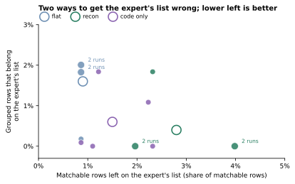
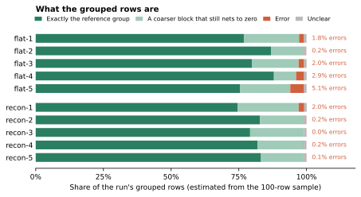
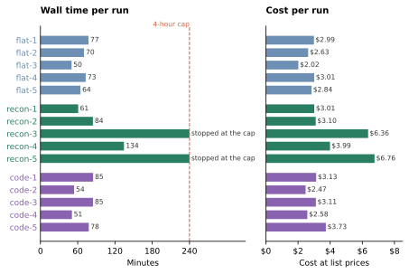

# Does a reconciliation pattern help a strong agent? Not in one shot

**The thesis:** pointing a strong agent at a reconciliation pattern didn't improve one-shot results.

On 3–4 October 2026, gpt-6.1-sol at max thinking did two real reconciliations in the Pi coding agent, five runs per arm. Arm *flat* got the task's brief alone. Arm *recon* got the same brief plus one sentence: "Use the idea in github:spoj/recon."

**Both arms matched a 136-line bank rec perfectly, and both failed the same judgment call in every run. On 16,933 intercompany items, at most 2% of the rows either arm grouped belonged on the expert's list, and 83–87% of the rows the arms left for the expert really needed one. Recon cost more: about 40% more tokens on the bank rec, and nearly twice the median time on the intercompany match, where two of its five runs hit the 4-hour cap. With the repo cut to code alone, the same prompt ran in about flat's time and kept most of recon's caution; every difference in list quality is within noise.**

| | flat | recon | recon, code only |
|---|--:|--:|--:|
| ***Bank rec, 136 lines*** | | | |
| Matching right on all three accounts | 5 of 5 | 5 of 5 | not run |
| Journal entries right | 0 of 5 | 0 of 5 | not run |
| Median minutes, cost, tokens | 11.5, $0.32, 223k | 12.3, $0.37, 316k | not run |
| ***Intercompany, 16,933 items; mean of 5 runs*** | | | |
| Grouped rows that belong on the expert's list | 1.6% | 0.4% | 0.6% |
| Matchable rows left on the expert's list | 0.9% | 2.8% | 1.5% |
| Rows on the list that really need the expert | 86.6% | 83.0% | 89.4% |
| Grouped rows in a defensible group | 96.7% | 98.6% | 98.0% |
| Median minutes, cost | 70, $2.84 | 134, $3.99 | 78, $3.11 |
| Runs stopped by the 4-hour cap | 0 of 5 | 2 of 5 | 0 of 5 |

Recon minus flat, with 95% intervals that resample both rows and runs: −1.2 points [−3.7, 0.0] for grouped rows that belong on the list, +2.0 [+0.5, +3.9] for matchable rows left on it, and −3.6 [−12.9, +8.7] for rows that really need the expert. The code-only arm is covered [below](#without-the-prose).

## What recon is

[spoj/recon](https://github.com/spoj/recon/tree/7e7b364), as these runs saw it, treats a reconciliation as a partition: matching rules compose into a strategy that puts every entry in exactly one group or in a residual left for review. Decisions about the residual, by a model or a person, are written as data, one override per decision keyed by row id with a reason, so that they are re-applied on every later run.

## The bank rec

A bank reconciliation explains, item by item, why the bank's balance differs from the ledger's at month-end. This one covered three accounts at a real month-end: 50 bank transactions and 86 ledger postings. A run had to match the two sides, classify what was left (outstanding cheques, deposits in transit, ledger errors) and propose the journal entries that fix the ledger, scored against a key built from the reviewed rec.

Every run got the matching and the classification right on all three accounts, and every run failed the same journal entry. A posting batch's title named one account while its line described a transfer to another. All ten runs noticed the conflict; none read it as the key does, as the transfer the line describes. That is a judgment about ledger evidence, which a matching technique doesn't address.

All five recon runs fetched the repo and four imported its code: a median 19 tool calls against 12, and 42% more tokens, for the same result.

## Intercompany matching

When companies in a group trade with each other, one's receivable is another's payable. Intercompany matching pairs the two sides' open items, so that items that settle or offset each other drop out. What is left goes to a person who investigates it; this post calls it **the expert's list**.

The data held 16,933 open items from more than a hundred companies, in 25 currencies, at one month-end. About 13% of rows are against companies whose books aren't in the file. The brief said the expert works the unmatched list and won't re-check groups. There is no answer key, so 100 rows were reviewed blind ([below](#how-far-to-trust-the-reference)).

### Isolating the expert's list

A run can get the list wrong in two ways: hide a row that needs the expert inside a group, or leave a matchable row on the list. Both arms did both rarely; recon hid fewer problem rows but left more matchable ones.

*Each dot is a run; rings are arm means. Each run's list held 2,023–2,706 rows; per-run intervals reach 6–8 points.*

Overall, the arm moved runs no further apart than the luck of the run did. Pairs of runs gave the same answer for 81% of rows within flat, 82% within recon and 82% across the two. All ten of their runs agreed on 65% of rows, and the two arms' majorities differ on 261 rows (1.5%).

### Coarse blocks

A group counts as exact only if it equals the reference group. Almost every inexact one is too coarse: a whole posting batch, or a whole trading relationship, where the data splits uniquely into invoices, as the reviewers found with a subset search. Such a block still nets to zero, so it costs the audit trail, not the expert's list; the table calls it defensible. That was 15% of flat's grouped rows and 18% of recon's. Real errors were rarer: 2.4% and 0.5%.

### What each arm's caution got right and wrong

Among the 100 reviewed rows, the arms parted on four kinds:

| Kind of row | Reference | flat runs that grouped it | recon runs that grouped it | Right |
|---|---|--:|--:|---|
| Old credits in one currency with no counterpart, swept into leftover blocks that don't net | leave on the list | 4 of 5 | 1 of 5 | recon |
| Loan repayments that can't be tied to a drawdown | leave on the list | 3 of 5 | 0–1 of 5 | recon |
| Same-day cross-currency mirror pairs, and a loan balance | group | 5 of 5 | 4 of 5 | flat |
| Exact subsets of a payables batch | group | 5 of 5 | 2 of 5 | flat |

The recon run that missed the cross-currency rows made no cross-currency groups at all.

### Why recon ran longer

*Runs stopped at the cap kept their last saved result.*

Both arms wrote the same thing: a waterfall of matching passes, each working on what the earlier ones left, typing 1,300–2,000 lines of code per run, rewrites included. Recon changed what came after. Four of five recon runs went on to rule on leftover rows one at a time, 49 to 197 rulings each, recorded as recon's row-id overrides. Two were still ruling when the cap stopped them.

On the reviewed rows, recon runs made 20 hand rulings, and 11 matched the reference. On the same rows, flat's runs got 40 of their 100 verdicts right. These are hard rows, and 20 rulings are too few to judge.

## Without the prose

A third arm, *code only*, ran recon's prompt word for word against spoj/recon [cut to code alone](https://github.com/spoj/recon/tree/b06663d). The README went from about 2,100 words to two sentences: "This is a combinator pattern for financial reconciliations. Point your agent to this repo to reference it." Every docstring and comment went too, and the example now prints its four kinds of outcome: grouped by a rule, grouped by an override, held by an override, and left over with no decision. The prose removed included the loop telling agents to keep writing overrides until the residual holds only what is genuinely open. This arm ran on the intercompany match only.

| | flat | recon | code only |
|---|--:|--:|--:|
| Minutes, median (range) | 70 (50–77) | 134 (61–240) | 78 (51–85) |
| Cost, median; all five runs | $2.84; $13.49 | $3.99; $23.22 | $3.11; $15.02 |
| Output tokens per run | 70–105k | 79–255k | 64–108k |
| Hand rulings per run, median (range) | — | 69 (0–197) | 7 (0–43) |

**Time and effort.** Code-only runs ran later, five at a time rather than ten, so their writing speed was checked before comparing wall times: 1,230–1,300 output tokens a minute, against flat's 1,320–1,440, so not faster. None hit the cap. The time recon spent went on hand rulings, and without the prose they fell from a median 69 per run to 7. The prose, not the code, drove recon's long tail of rulings.

**List quality.** On its own, the code kept most of recon's caution at about flat's time and cost. Every difference is within noise:

| Code only minus …, 95% interval | flat | recon |
|---|--:|--:|
| Grouped rows that belong on the list | −1.0 [−3.0, 0.0] | +0.2 [−0.9, +1.7] |
| Matchable rows left on the list | +0.7 [−0.4, +2.4] | −1.3 [−3.3, +0.5] |
| Rows on the list that really need the expert | +2.8 [−5.4, +15.7] | +6.4 [−0.3, +13.3] |

On the four kinds of row where flat and recon parted, code only grouped the old credits and loan repayments in 1–2 of 5 runs, close to recon; the cross-currency pairs in 5 of 5, like flat; and the batch subsets in 2–3 of 5.

**Coarseness.** Code only lumped more: 74.6% of its grouped rows were in exactly the reference group, against 81.4% for flat and 80.3% for recon, though 98.0% were defensible. Most of that is one run, code-3: 63% exact, in 4,402 groups where the others made about 5,400. It was also the least like any other run, agreeing with each on 59–68% of rows. Two code-only runs agreed on 73% of rows on average, or 75–83% without code-3, against 81% within flat and 82% within recon.

**Caveats.** Code only ran later and five at a time; its writing speed was checked and is no faster. It was scored on the same 100 rows, drawn from the first ten runs' disagreements. The reviewers never saw its groups, so an equally right group that no earlier run proposed counts as wrong.

## How far to trust the reference

| Check | Finding |
|---|---|
| Who reviewed | Two reviewers, Claude Opus 5.5 at max thinking, a different model family from the runs, each deciding all 100 rows independently |
| What they saw | Blinded cards: the groups the runs proposed, shuffled, without arm, run counts or notes, plus a search of the data done without the runs |
| How far they agreed | The same reference on 99 rows; both marked the 100th unclear. Being the same model, they overstate how far human experts would agree |
| Errors every run shares | Rows were sampled toward disagreement, so an error all ten flat and recon runs share, in under about 5% of the rows they agree on, would mostly go unseen |
| One heavy row | All of flat's missed matches come from one reviewed row standing for about 127: a large balance both companies booked under one shared reference, a trivial amount apart. The reviewers grouped it; all ten flat and recon runs left it, so it cancels between those arms |

## What this does and doesn't show

| Limit | Effect |
|---|---|
| One shot | Recon's promise, in its author's view, is decisions that survive a re-run on next month's data. That is untested here |
| One model, gpt-6.1-sol at max thinking, and one month of each data set | Weaker models or other months may differ |
| Five runs per arm | Small effects would not show. The bank rec was at the ceiling for matching, so it can't separate the arms |
| One sentence of instruction | Shows a strong agent merely pointed at the repo, not a brief written around recon |

## Method

- **Agent:** the Pi coding agent with gpt-6.1-sol at max thinking, read, bash, edit and write tools, and no extensions, skills or context files. Each run sat in a container that could see only the task's inputs. The network was open, so recon runs could fetch the repo; none of the repo owner's public repos holds either data set.
- **Arms:** flat and recon were identical except for the prompt, and all their runs of a benchmark ran in parallel on one model account. Code only used recon's prompt against spoj/recon at commit b06663d, on the intercompany match only, five runs in parallel after the others had finished.
- **Bank rec:** a 120-minute limit. Per account, a run was scored on whether the balances tie, row-level precision and recall, and category accuracy; journal entries, on the net change per ledger account.
- **Intercompany:** the brief stated the 4-hour stop. A result had to place every row exactly once, in a group of two or more or unmatched with a note; all fifteen did. The 100 reviewed rows were a stratified sample by how far the ten flat and recon runs agreed: 15 where all ten grouped the row alike, 15 where all ten left it unmatched, 20 where the arms' majorities differ, 20 where nine of ten agree and 30 contested. Rates are Horvitz–Thompson estimates, with intervals from a stratified bootstrap of 2,000 resamples. On synthetic data with planted errors, per-run 95% intervals covered the truth about 95% of the time.
- **Costs:** Pi's estimate at list API prices; the runs used a subscription. The bank-rec runs cost $3.57 in all, the intercompany runs $36.71 for flat and recon and $15.02 for code only, and the review $33.78.
